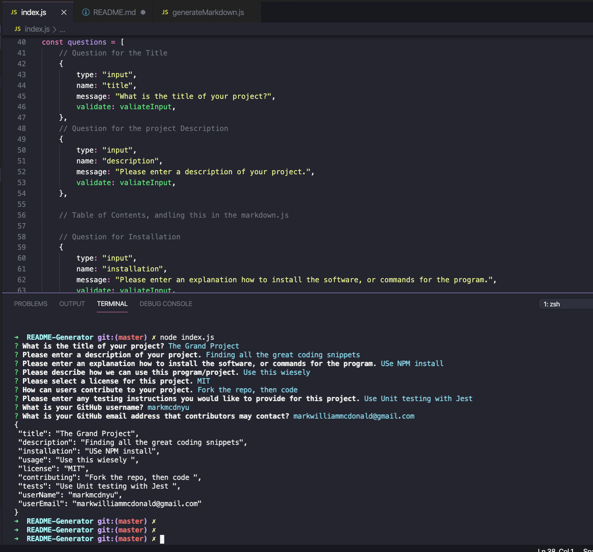

# README Generator: Node.js and ES6+ Work

For an open source project on GitHub, having a comprehensive README is crucial. It should clearly outline the app's functionality, installation steps, usage instructions, how to report problems, and guidelines for contributing. To facilitate this, a command-line tool can swiftly create a well-organized project README. This approach helps project creators dedicate more time to developing the project and less to writing a detailed README.

I created a command-line application that dynamically generates a professional README.md from a user's input using the [Inquirer package](https://www.npmjs.com/package/inquirer). The application will be invoked with the following command:

```
node index.js
```

## Application Running in Command Line
The following picture shows the command line functionality of the program:



## User Story

```
AS A developer
I WANT a README generator
SO THAT can quickly create a professional README for a new project
```

## Acceptance Criteria

```md
GIVEN a command-line app for user input
WHEN prompted for application repository info
THEN generate a README.md with project title, Description, Table of Contents, Installation, Usage, License, Contributing, Tests, and Questions
WHEN project title entered
THEN display as README title
WHEN entering description, installation, usage, contribution, and test instructions
THEN add to respective README sections
WHEN selecting a license
THEN add license badge near README top and notice in License section
WHEN entering GitHub username
THEN add to README's Questions with GitHub profile link
WHEN entering email
THEN add to README's Questions with contact instructions
WHEN clicking Table of Contents links
THEN navigate to corresponding README section.

## Application Requirements

* Functional application.

* Here is my <a href="https://github.com/nicolemneary/Nicole-s-ReadMe-Generator-" target="_blank">GitHub Repo Link</a>.

## The generated README includes the following sections: 

  * Title
  * Description
  * Table of Contents
  * Installation
  * Usage
  * License
  * Contributing
  * Tests
  * Questions

* The generated README includes 1 badge that's specific to the repository.


## Environment
* JavaScript
* Node.js


## Contributors 
* Nicole Neary
* GitHub: nicolemneary